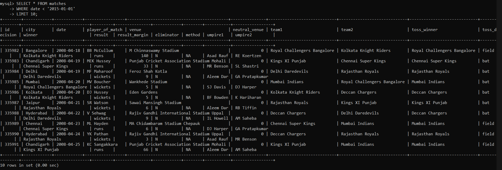

# **Problem Statement 2**

> Methods and solutions are well explained here. Highly recommended to go through `Readme.md` to understand the methods and solutions of the project.

## Introduction

As a data analysis intern, you have to analyse sports data for a client. You are given two datasets related to IPL (Indian Premier League) cricket matches. One dataset contains ball-by-ball data and the other contains match-wise data. You have to import the datasets into an SQL database and perform the tasks given in this assignment to find important insights from this dataset.


## About the Data


#### The "IPL_Ball.csv" file is for ball-by-ball data and it has information of all the 19,3468 balls bowled between the years 2008 and 2020. It has 17 columns.
#### The "IPL_matches.csv" file contains match-wise data and has data of 816 IPL matches. This table has 17 columns.
---------------------------------------------------------------------------------------------
## **Project**

### *__Prerquisites before solving the problem statement__*


* Creating a database in MySQL Commandline Client
```sql
CREATE DATABASE ipl;
```
* Using the database
```sql
use ipl;
```

**1. Create a table named `matches` with appropriate data types for columns.**

`id` is used as `PRIMARY KEY` here.
```sql
CREATE TABLE matches(
    id INT PRIMARY KEY,
    city VARCHAR(40),
    date DATE,
    player_of_match VARCHAR(40),
    venue VARCHAR(80),
    neutral_venue INT,
    team1 VARCHAR(80),
    team2 VARCHAR(80),
    toss_winner VARCHAR(80),
    toss_decision VARCHAR(20),
    winner VARCHAR(80),
    result VARCHAR(40),
    result_margin INT,
    eliminator VARCHAR(10),
    method VARCHAR(10),
    umpire1 VARCHAR(40),
    umpire2 VARCHAR(40)
);
```
Then describe the table.
```sql
DESCRIBE matches;
```


**2. Create a table named `deliveries` with appropriate data types for columns.**

Here `id` is used as a `FOREIGN KEY`.

```sql
CREATE TABLE deliveries (
    `id` INT,
    `inning` INT,
    `over` INT,
    `ball` INT,
    `batsman` VARCHAR(40),
    `non_striker` VARCHAR(40),
    `bowler` VARCHAR(40),
    `batsman_runs` INT,
    `extra_runs` INT,
    `total_runs` INT,
    `is_wicket` INT,
    `dismissal_kind` VARCHAR(40),
    `player_dismissed` VARCHAR(40),
    `fielder` VARCHAR(40),
    `extras_type` VARCHAR(40),
    `batting_team` VARCHAR(40),
    `bowling_team` VARCHAR(40),
     FOREIGN KEY(id) REFERENCES matches(id)
);
```
Describing the Table.
```sql
DESCRIBE deliveries;
```


**3. Import data from CSV file 'IPL_matches.csv' attached in resources to `matches`**

*Prerequisite*

* Open the csv files and save as in 'CSV MS-DOS' format to avoid encryption (It is probably 'CSV comma delimited' prior). 

* Remove all the commas contained in the observations using excel by, Selecting the column > Home > Editing tab > Find & Select > Replace.

* Change to yyyy-mm-dd format by right cick > Format cells > Number > Time > selecting 'yyyy-mm-dd' format > Ok. And save te file.

* For the sql version above 5.6, there must be a restriction to import file. So, you have to paste the importing file in the file directory. File directories are mostly a hidden file.

* Check the directory.

```sql
show variables like "secure_file_priv";
```


* Apply show all hidden files > search the directory in pc > paste the files in the directory.

Importing 'IPL_matches.csv'.

```sql
LOAD DATA INFILE "C:\\ProgramData\\MySQL\\MySQL Server 8.0\\Uploads\\IPL_matches.csv" INTO TABLE matches
FIELDS TERMINATED BY ','
LINES TERMINATED BY '\n'
IGNORE 1 LINES
(id,city,date,player_of_match,venue,neutral_venue,team1,team2,toss_winner,toss_decision,winner,result,result_margin,eliminator,method,umpire1,umpire2)
;
```


**4. Import data from CSV file ’IPL_Ball.csv’ attached in resources to ‘deliveries’**

```sql
LOAD DATA INFILE "C:\\ProgramData\\MySQL\\MySQL Server 8.0\\Uploads\\IPL_Ball.csv" INTO TABLE deliveries
FIELDS TERMINATED BY ','
LINES TERMINATED BY '\r\n'
IGNORE 1 LINES;
```


**5. Select the top 20 rows of the deliveries table.**

```sql
SELECT * FROM deliveries
LIMIT 20;
```


**6. Select the top 20 rows of the matches table.**

```sql
SELECT * FROM matches
LIMIT 20;
```


**7. Fetch data of all the matches played on 2nd May 2013.**

```sql
SELECT * FROM matches
WHERE date = '2008-05-02';
```


**8. Fetch data of all the matches where the margin of victory is more than 100 runs.**

```sql
SELECT * FROM matches
WHERE result_margin > 100;
```


**9. Fetch data of all the matches where the final scores of both teams are tied and order it in descending order of the date.**

```sql
SELECT * FROM matches
WHERE result = 'tie'
ORDER BY date DESC;
```


**10. Get the count of cities that have hosted an IPL match.**
```sql
SELECT COUNT(DISTINCT city) 
FROM matches;
```


**11. Get the count of venues that have hosted IPL matches.**

```sql
SELECT COUNT(DISTINCT venue)
FROM matches;
```


**12. Fetch data of 10 matches played before 2015.**

```sql
SELECT * FROM matches
WHERE date < '2015-01-01'
LIMIT 10;
```

